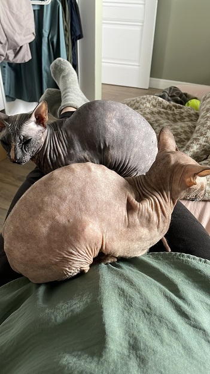

## Настало время и вам немного узнать обо мне)

Начну с детства...
Да ну нет, кому это нужно?)

Итак, меня зовут Надя, мне 37 годиков. Родилась, училась, женилась в Санкт-Петербурге.
- люблю кофе
- люблю своих двух сфинксов

  
- люблю мужа. Причем да, именно в таком порядке)
- люблю куда-нибудь ездить, только вот эта любовь в последнее время не взаимна, к сожалению.
- люблю монотонную работу. Реально люблю, хотя многие мне и не верят)

  Много лет работаю в одной компании, которая профильно занимается маркетинговыми исследованиями. И захотелось мне слегка расширить квалификацию. Фактически, я уже и такфактически - ручной тестировщик, проверяю правильность программирования анкет, чтобы вопросы все задавали как нужно и в нужном порядке. Захотелось получить доп навыки, тем более что сама профессия подходит мне по складу ума и характера. Надеюсь, что не слишком поздно спохватилась и возраст не станет помехой в поиске новой работы)

Интересно, написанного достаточно для получения зачета?)

Ну все, пойду кофе попью, ЧАО 

